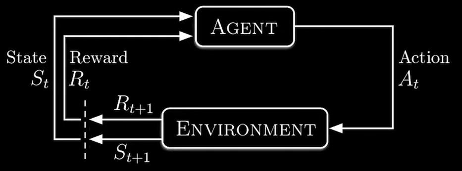
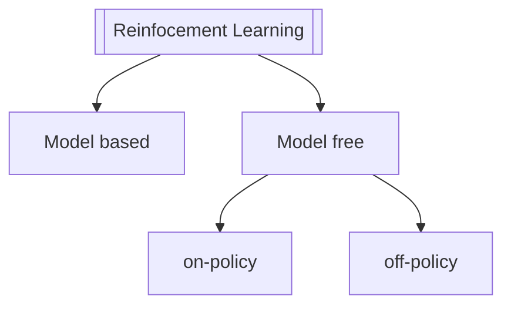

# Definition
RL is one of the main three areas of machine learning (reinforcement learning, supervised learning and unsupervised learning).  
It concerns how an intelligent agent should take actions to maximize cumulative reward.
  

## Types

## Policy
In AI and Reinforcement Learning (RL), policy refers to an agent's strategy to interact with an environment. Policies define the behavior of an agent. A policy determines the next action an agent takes in response to the current state of the environment.  
  
A policy is a function that maps a state to an action. Depending on the context and problem at hand, policies can be deterministic or stochastic.

- A ***deterministic policy*** is a policy that maps each state to a single action with certainty. In other words, the agent will always take the same action given a state. This policy is represented by a function $π: S→A$, where S is the state space, and A is the action space. The deterministic policy function maps each state $s ∈ S$ to a single action $a ∈ A$.
  
    The advantage of a deterministic policy is that it is easy to interpret and implement. It is also suitable for tasks where the same action should be taken for the same state every time. For example, in a chess game, the best move for a given board configuration is always the same. A deterministic policy can be the best choice to play the game optimally in such cases.
  
- A ***stochastic policy*** is a policy that maps each state to a probability distribution over actions. In other words, given a state, the agent will choose an action randomly based on the probability distribution. We represent this policy by a function $π: S × A → [0,1]$, where $S$ is the state space, $A$ is the action space, and $π(s, a)$ is the probability of taking action $a$ in a state $s$.
  
    The advantage of a stochastic policy is that it can capture the uncertainty in the environment. For example, in a poker game, the agent may not always take the same action in response to the same hand since there is a probability of winning or losing depending on the opponent’s hand and how the betting has proceeded. In such cases, a stochastic policy learns the best strategy based on the probability of winning.
  

The goal of a reinforcement learning agent is to learn a policy: $π : S × A → [0, 1]$, $\pi(s, a) = \Pr(A_t = a \mid S_t = s)$ that maximizes the expected cumulative reward.
  
When the agent's performance is compared to that of an agent that acts optimally, the difference in performance gives rise to the notion of regret. In order to act near optimally, the agent must reason about the long-term consequences of its actions (i.e., maximize future income), although the immediate reward associated with this might be negative. 
  
## Exploration
Reinforcement learning requires clever exploration mechanisms.  
One such method is $ε$-greedy, where $0 < ε < 1$ is a parameter controlling the amount of exploration vs. exploitation. With probability $1 − ε$, exploitation is chosen, and the agent chooses the action that it believes has the best long-term effect
  
## Use cases
- A model of the environment is known, but an analytic solution is not available
- Only a simulation model of the environment is given (the subject of simulation-based optimization)
- The only way to collect information about the environment is to interact with it

## Resources
- https://www.youtube.com/watch?v=NFo9v_yKQXA&list=PLzvYlJMoZ02Dxtwe-MmH4nOB5jYlMGBjr
- https://en.wikipedia.org/wiki/Reinforcement_learning
- https://www.baeldung.com/cs/rl-deterministic-vs-stochastic-policies